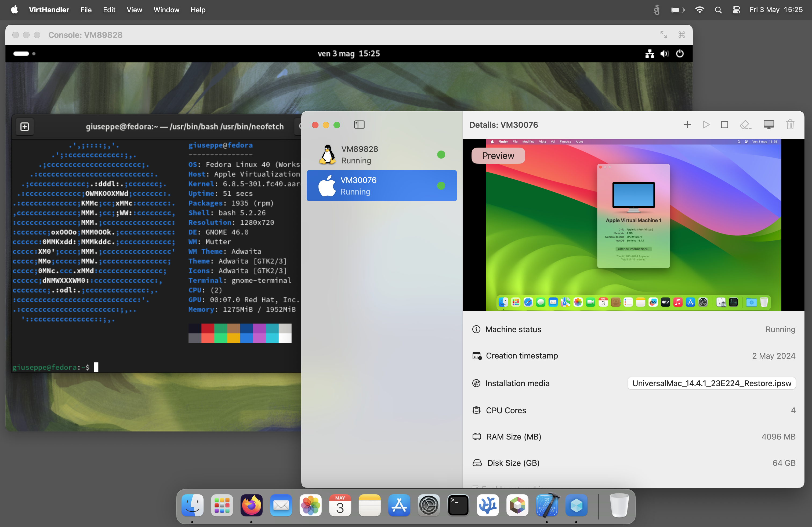

# VirtHandler's official Wiki
## Table of Content
- [Where is the source code?](#where-is-the-source-code)
- [Application description](#application-description)
- [VirtHandler in action](#virthandler-in-action)
#### Application setup
- [How to install the application](./setup-help.md#how-to-install)
#### Creation of a new Virtual Machine
- [Linux virtual machine instructions](./linux-help.md)
  - [Accessig your shared directory on Linux](./linux-help.md#how-to-access-the-shared-folder)
  - [Running Intel binaries on Linux with Rosetta 2](https://developer.apple.com/documentation/virtualization/running_intel_binaries_in_linux_vms_with_rosetta#3978496) (Official Apple documentation)
- [macOS virtual machine instructions](./macos-help.md)

## Where is the source code?
VirtHandler is currently hosted on a private repository. This is the official documentation, and binary releases will also be published here.
Also, this is the right place to open up abount issues, therefore feel free to report any bugs and broken features! 

<ins>**VirtHandler is currently in beta and soon it will aproach AppStore release, until then i will upload free testing builds on this repository's Release section**</ins>

## Application description
VirtHandler is a **Virtual Machine Manager** for the macOS operating system. The minimum supported configuration is **macOS Sonoma**, version 14.0 with **Apple Silicon** hardware *(All Macs from November 2020, going forward, are supported)*. The application has been developed using **SwiftUI** as it's core user interface framework, **SwiftData** for data management and **Apple Virtualization Framework** for the virtual machine magic. **AppKit** was also used, to develop custom functionality that was not achievable with SwiftUI's application life-cycle.

- Full generic OS virtualization support.
  - Supports any configuration that follows the [VirtIO specification](https://docs.oasis-open.org/virtio/virtio/v1.2/csd01/virtio-v1.2-csd01.html).
- Full macOS virtualization support.
  - With assisted installation process.
- Scalable Virtual Machine specifications.
  - Completely customizable by the end-user
- Featureful interactive console.
  - Supports virtual screen auto-resizing
  - Supports system key combinations pass-through
- Supports running **x86_64** binaries on virtualized Linux with [Rosetta 2](https://support.apple.com/en-mide/102527).

It features English and Italian localization!

# VirtHandler in action

