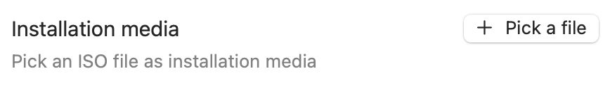
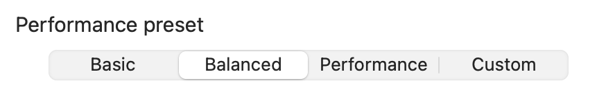

# [<- Back to main page](./README.md)

# Linux virtual machine instructions
## Before we start
>[!WARNING]
>Most of Linux distributions out there, provide installation images for **Intel** processors, that are built with the **x86_64** architecture (most of the time they are labeled **amd64**). These images **are not compatible** with VirtHandler, because >your mac has an **Apple Silicon** processor, that uses the **ARM64** architecture. If you are knowledgeable enough, feel free to use whatever Linux distribution you prefer.

>[!NOTE]
>As before said, you are free to use whatever Linux distribution you want, as long as it is compatible with **ARM64** processors, but you may prefer to use one of the following recommended Linux images:
> - [Debian 12 for ARM64](https://cdimage.debian.org/debian-cd/current/arm64/iso-cd/) Good for every use-case
> - [Fedora Workstation 40 Live for ARM64](https://dl.fedoraproject.org/pub/fedora/linux/releases/40/Workstation/aarch64/iso/Fedora-Workstation-Live-osb-40-1.14.aarch64.iso) Ideal to use with a graphical interface
> - [Ubuntu server 24.04 LTS](https://cdimage.ubuntu.com/releases/24.04/release/ubuntu-24.04-live-server-arm64.iso) Ideal for a CLI-base environment, includes lots of good server facilities.

## Let's get to it!
- Download the Linux distribution of your choice, in .ISO file format
  - *(Optional)* Usually these images aren't very big, but you can still sip off a cup o tea while you wait!

  

  
- Start VirtHandler, and click on "**+ Create a new Virtual Machine**"

  

- Under "Operating System", select **Linux** as the operating system of your choice

  

- Under "Generics", click on "**+ Pick a file**" to open the Finder file picker

  

- Select the previously downloaded .ISO image

  

- Select the desired performance preset
>[!TIP]
>Leave this setting on **Balanced** if you don't care or know exactly what you are doing!

  

>[!IMPORTANT]
> **In case of custom parameters**: Depending on what kind of Linux environment you want, the minimum requirements may change drastically. To make things simple for you, VirtHandler's default values are tailored to give enough breathing room for most use cases. Also, your physical mac will not slow-down due to having an excessive amount of resources allocated to the VM.

  

- Select the optional features to enable for your virtual machine

>[!NOTE]
> All of these options are straight forward. The only one that may require some exta steps is **"Enable shared directory"**: this option creates for you a folder that is shared between your mac and your Linux virtual machine, allowing you to transfer documents and other files facilitating you work. To know more on how to use this feature keep reading!

  

- When you are satisfied with your options, click on **Confirm and Create**

  

- Select your newly created virtual machine from the menu on your left
- Now you can start it using the button in the top right corner

  

- Profit

### A sidenote on the installation process
Every Linux distribution out there provides their own installer, unfortunately VirtHandler cannot automate the process for you. However, don't be scared to try and make mistakes, after all it's just a virtual machine, you can scrap it and start from scratch!
