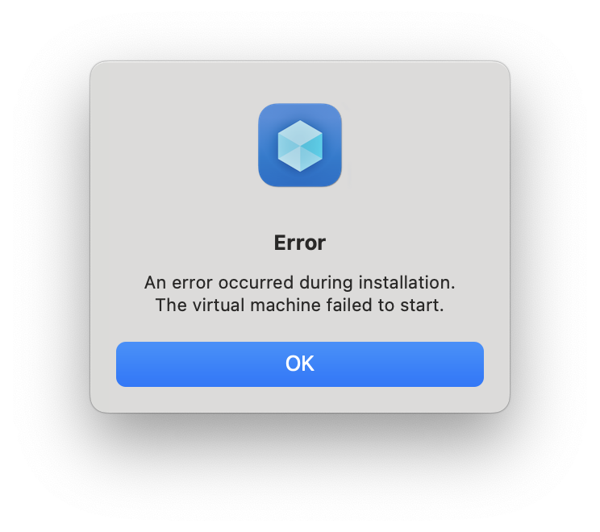
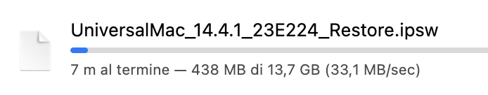
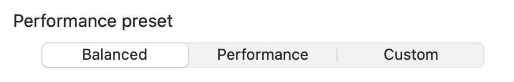
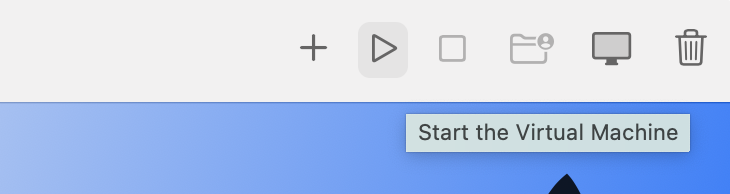

# [<- Back to main page](./README.md)

# macOS virtual machine instructions
The process for creating a macOS virtual machine is in every aspect identical to creating a Linux one. The differences start with the installation of the operating system: every Linux distribution out there provides their own installer, and that means that the installation process is up to the user to be done. With a macOS VM, VirtHandler will guide you all the way through.
## ⚠️ Before you start ⚠️
Unfortunately due to a limitation imposed by Apple, you can create as many macOS VMs as you want, but **you can only start two at any given time**. If you try to start more than two macOS virtual machines, you will greeted by one of these errors below

  
  
  

## Acquiring a macOS restore image
In order to be able to install macOS on you shiny new virtual machine, you need a **macOS recovery image**. You can find them on the internet but don't worry if you don't know where to look for, because we got you covered: use [**this website**](https://ipsw.me/VirtualMac2,1)
- Select the desired macOS version from the list of available images

  

- Click on the **big blue download button**

  

- Congratulations you have a restore image!
  - (*Optional*) While the gargantuan download finishes, you can sip off a cup of tea

  

## Creation of the virtual machine  
- Start VirtHandler, and click on "**+ Create a new Virtual Machine**"

  

- Under "Operating System", select **macOS** as the operating system of your choice

  

- Under "Generics", click on "**+ Pick a file**" to open the Finder file picker

  

- Select the .IPSW image you just downloaded

  

- Select the Performance profile that you prefer (leave **Balanced** if you don't care)

  

⚠️ **IN CASE OF CUSTOM PARAMETERS** ⚠️  
VirtHandler will notify you if the specifications you set don't meet the minimum requirements

  

- Select the optional features to enable for your virtual machine

All of these options are straight forward. The only one that may require some exta explaination is **"Enable shared directory"**: this option creates for you a folder that is shared between your physical mac and your macOS virtual machine, allowing you to transfer documents and other files facilitating you work.

  

- When you are satisfied with your options, click on **Confirm and Create**

  

## macOS installation process
Select your newly created virtual machine from the menu on your left. You will see that the start button in the top right corner is locked.
- Click on the little **Play button** in the top right corner to start the VM

  

- Select "**Confirm**" when the alert dialog pops up

  

- The installation process will start, don't worry if it takes time!
  - (*Optional*) While the installation process finishes, you can drink a cup of coffe or stretch you legs a bit.

  

When the installation reaches 100%, a button labeled "**OK**" will appear on the installation dialog
- Click it
- Profit

And that's it! You can now start your fresh macOS virtual machine!

## A sidenote on this procedure
Don't throw away your .IPSW files! VirtHandler needs them to initialize your virtual machine every time you start the application. If the original file is deleted, or moved, the virtual machine will report a configuration error.
Don't worry, you can always tell VirtHandler to use another file: select your VM from the main menu and click on the installation media to select a new one.

  

